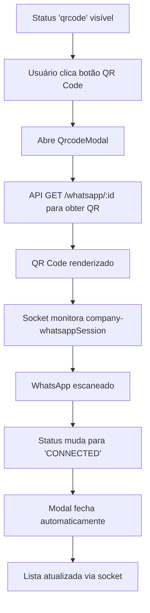
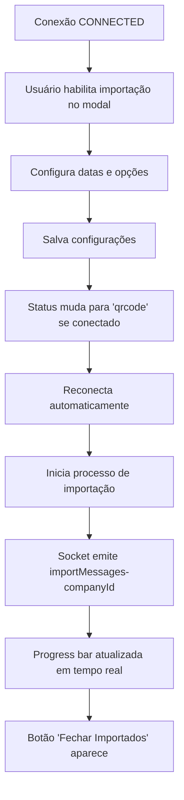
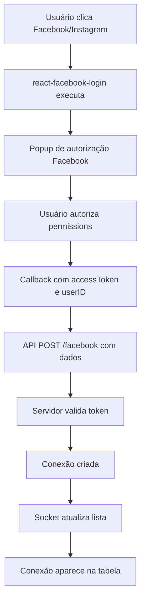
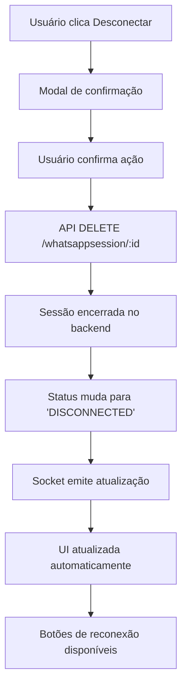
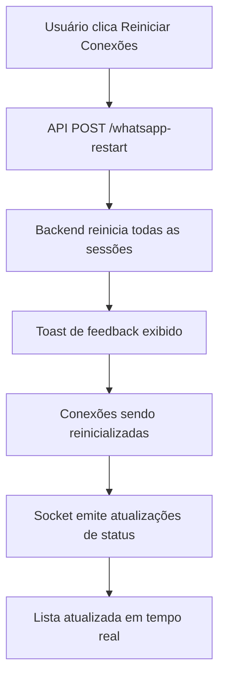

# 📱 Documentação Completa - Página Connections

## 📋 Índice
1. [Visão Geral](#visão-geral)
2. [Estrutura de Arquivos](#estrutura-de-arquivos)
3. [Funcionalidades Principais](#funcionalidades-principais)
4. [Componentes Utilizados](#componentes-utilizados)
5. [Estados e Contextos](#estados-e-contextos)
6. [Integrações e APIs](#integrações-e-apis)
7. [Lógica de Negócio](#lógica-de-negócio)
8. [Permissões e Segurança](#permissões-e-segurança)
9. [WebSocket e Tempo Real](#websocket-e-tempo-real)
10. [Internacionalização](#internacionalização)
11. [Estilos e UI/UX](#estilos-e-uiux)
12. [Fluxos de Integração](#fluxos-de-integração)

---

## 📖 Visão Geral

A página `/connections` é responsável por gerenciar todas as conexões de WhatsApp, Facebook e Instagram da empresa. É uma das páginas mais críticas do sistema, permitindo:

- **Visualização** de todas as conexões ativas/inativas
- **Criação** de novas conexões para diferentes canais
- **Configuração** avançada de cada conexão
- **Monitoramento** de status em tempo real
- **Importação** de mensagens históricas
- **Gestão** de sessões e QR codes

### Arquivo Principal
`frontend/src/pages/Connections/index.jsx`

---

## 📁 Estrutura de Arquivos

### Arquivo Principal
- `frontend/src/pages/Connections/index.jsx` - Componente principal

### Componentes Dependentes
- `frontend/src/components/WhatsAppModal/index.jsx` - Modal de configuração
- `frontend/src/components/QrcodeModal/index.jsx` - Modal de QR code
- `frontend/src/components/ConfirmationModal` - Confirmações de ação
- `frontend/src/components/MainContainer` - Container principal
- `frontend/src/components/MainHeader` - Cabeçalho da página
- `frontend/src/components/TableRowSkeleton` - Loading da tabela
- `frontend/src/components/Can` - Controle de permissões

### Contextos
- `frontend/src/context/WhatsApp/WhatsAppsContext.jsx` - Estado global das conexões
- `frontend/src/context/Auth/AuthContext` - Contexto de autenticação

### Hooks
- `frontend/src/hooks/useWhatsApps/index.js` - Hook para gerenciar conexões
- `frontend/src/hooks/usePlans.js` - Hook para planos e limites

### Utilitários
- `frontend/src/utils/formatSerializedId.js` - Formatação de números
- `frontend/src/translate/i18n.js` - Internacionalização

---

## ⚙️ Funcionalidades Principais

### 1. **Gestão de Conexões Multi-Canal**

#### WhatsApp
- ✅ Conectar via QR Code
- ✅ Desconectar sessão
- ✅ Renovar QR Code
- ✅ Reconectar automaticamente
- ✅ Status em tempo real

#### Facebook
- ✅ Login via Facebook API
- ✅ Configuração de páginas
- ✅ Gerenciamento de permissions
- ✅ Business management (opcional)

#### Instagram
- ✅ Integração via Facebook API
- ✅ Direct messages
- ✅ Configurações avançadas

### 2. **Estados de Conexão**

```javascript
// Estados possíveis das conexões
const connectionStates = {
  'DISCONNECTED': 'Desconectado - necessita ação',
  'OPENING': 'Conectando - aguardar',
  'qrcode': 'QR Code disponível - escanear',
  'CONNECTED': 'Conectado - operacional',
  'PAIRING': 'Pareando dispositivo',
  'TIMEOUT': 'Timeout - reconectar'
}
```

### 3. **Importação de Mensagens Históricas**

#### Funcionalidades:
- ✅ Importar mensagens antigas (período selecionável)
- ✅ Importar mensagens recentes
- ✅ Incluir ou excluir grupos
- ✅ Fechar tickets automático pós-importação
- ✅ Progress tracking em tempo real
- ✅ Fila específica para importação

#### Estados de Importação:
- `preparing`: Preparando importação
- `importing`: Importando mensagens
- `renderButtonCloseTickets`: Pronto para fechar tickets

### 4. **Gerenciamento de Sessões**

#### Operações:
- **Iniciar sessão**: `/whatsappsession/:id` (POST)
- **Renovar QR**: `/whatsappsession/:id` (PUT)
- **Desconectar**: `/whatsappsession/:id` (DELETE)
- **Reiniciar todas**: `/whatsapp-restart/` (POST)

---

## 🧩 Componentes Utilizados

### Componentes MUI
```javascript
// Material-UI Components
import {
  Button, Table, TableBody, TableRow, TableCell,
  TableHead, Paper, Tooltip, Typography,
  CircularProgress, Box, Card, CardContent,
  IconButton, Menu, MenuItem
} from "@mui/material";

// Icons
import {
  Edit, CheckCircle, SignalCellularConnectedNoInternet2Bar,
  SignalCellularConnectedNoInternet0Bar, SignalCellular4Bar,
  CropFree, DeleteOutline, Facebook, Instagram,
  WhatsApp, AddCircleOutline
} from "@mui/icons-material";
```

### Componentes Customizados
- **CustomToolTip**: Tooltips informativos com título e conteúdo
- **CircularProgressWithLabel**: Progress circular com percentual
- **IconChannel**: Ícones específicos por canal (WhatsApp, Facebook, Instagram)

---

## 🏪 Estados e Contextos

### Estado Local (useState)
```javascript
const [hasMore, setHasMore] = useState(false); // Paginação
const [pageNumber, setPageNumber] = useState(1); // Página atual
const [whatsAppModalOpen, setWhatsAppModalOpen] = useState(false); // Modal conexão
const [statusImport, setStatusImport] = useState([]); // Status importação
const [qrModalOpen, setQrModalOpen] = useState(false); // Modal QR Code
const [selectedWhatsApp, setSelectedWhatsApp] = useState(null); // Conexão selecionada
const [confirmModalOpen, setConfirmModalOpen] = useState(false); // Modal confirmação
const [confirmModalInfo, setConfirmModalInfo] = useState({...}); // Info confirmação
const [planConfig, setPlanConfig] = useState(false); // Configurações do plano
```

### Contextos Globais
```javascript
const { whatsApps, loading } = useContext(WhatsAppsContext); // Lista de conexões
const { user, socket } = useContext(AuthContext); // Usuário e socket
```

### Configuração de Modais
```javascript
const confirmationModalInitialState = {
  action: "", // 'disconnect' | 'delete' | 'closedImported'
  title: "",  // Título do modal
  message: "", // Mensagem de confirmação
  whatsAppId: "", // ID da conexão
  open: false  // Estado do modal
};
```

---

## 🔌 Integrações e APIs

### Endpoints WhatsApp
```javascript
// Listagem e detalhes
GET /whatsapp/?session=0 // Listar conexões
GET /whatsapp/:id // Detalhes de uma conexão
POST /whatsapp // Criar nova conexão
PUT /whatsapp/:id // Atualizar conexão
DELETE /whatsapp/:id // Deletar conexão

// Sessões
POST /whatsappsession/:id // Iniciar sessão
PUT /whatsappsession/:id // Renovar QR Code
DELETE /whatsappsession/:id // Desconectar

// Operações especiais
POST /whatsapp-restart/ // Reiniciar todas conexões
POST /closedimported/:id // Fechar tickets importados
```

### Endpoints Facebook
```javascript
POST /facebook // Criar conexão Facebook/Instagram
// Payload: { facebookUserId, facebookUserToken, addInstagram? }
```

### Endpoints Auxiliares
```javascript
GET /queue // Listar filas
GET /prompt // Listar prompts IA
GET /queueIntegration // Listar integrações
GET /flowbuilder // Listar fluxos
```

---

## 💼 Lógica de Negócio

### 1. **Verificação de Planos**

```javascript
// Verificar limites do plano da empresa
const { getPlanCompany } = usePlans();

useEffect(() => {
  async function fetchData() {
    const planConfigs = await getPlanCompany(undefined, companyId);
    setPlanConfig(planConfigs);
  }
  fetchData();
}, []);

// Controle de funcionalidades por plano
<MenuItem 
  disabled={planConfig?.plan?.useWhatsapp ? false : true}
  onClick={handleOpenWhatsAppModal}
>
  WhatsApp
</MenuItem>
```

### 2. **Gestão de Status em Tempo Real**

```javascript
// Renderização de status visual
const renderStatusToolTips = (whatsApp) => {
  switch(whatsApp.status) {
    case "DISCONNECTED":
      return <SignalCellularConnectedNoInternet0Bar style={{ color: "#E57373" }} />;
    case "OPENING":
      return <CircularProgress size={24} />;
    case "qrcode":
      return <CropFree />;
    case "CONNECTED":
      return <SignalCellular4Bar style={{ color: green[500] }} />;
    case "TIMEOUT":
    case "PAIRING":
      return <SignalCellularConnectedNoInternet2Bar style={{ color: "#E57373" }} />;
  }
};
```

### 3. **Botões de Ação Dinâmicos**

```javascript
const renderActionButtons = (whatsApp) => {
  // QR Code disponível
  if (whatsApp.status === "qrcode") {
    return (
      <Button onClick={() => handleOpenQrModal(whatsApp)}>
        {i18n.t("connections.buttons.qrcode")}
      </Button>
    );
  }
  
  // Desconectado - opções de reconexão
  if (whatsApp.status === "DISCONNECTED") {
    return (
      <>
        <Button onClick={() => handleStartWhatsAppSession(whatsApp.id)}>
          {i18n.t("connections.buttons.tryAgain")}
        </Button>
        <Button onClick={() => handleRequestNewQrCode(whatsApp.id)}>
          {i18n.t("connections.buttons.newQr")}
        </Button>
      </>
    );
  }
  
  // Conectado - opções de desconexão
  if (["CONNECTED", "PAIRING", "TIMEOUT"].includes(whatsApp.status)) {
    return (
      <>
        <Button onClick={() => handleOpenConfirmationModal("disconnect", whatsApp.id)}>
          {i18n.t("connections.buttons.disconnect")}
        </Button>
        {renderImportButton(whatsApp)}
      </>
    );
  }
  
  // Conectando - botão desabilitado
  if (whatsApp.status === "OPENING") {
    return (
      <Button disabled>
        {i18n.t("connections.buttons.connecting")}
      </Button>
    );
  }
};
```

### 4. **Importação de Mensagens**

```javascript
const renderImportButton = (whatsApp) => {
  // Botão para fechar tickets importados
  if (whatsApp?.statusImportMessages === "renderButtonCloseTickets") {
    return (
      <Button onClick={() => handleOpenConfirmationModal("closedImported", whatsApp.id)}>
        {i18n.t("connections.buttons.closedImported")}
      </Button>
    );
  }

  // Status de preparação (35 segundos)
  if (whatsApp?.importOldMessages) {
    const isTimeStamp = !isNaN(new Date(Math.floor(whatsApp?.statusImportMessages)).getTime());
    
    if (isTimeStamp) {
      const ultimoStatus = new Date(Math.floor(whatsApp?.statusImportMessages)).getTime();
      const dataLimite = add(ultimoStatus, { seconds: 35 }).getTime();
      
      if (dataLimite > new Date().getTime()) {
        return (
          <Button disabled endIcon={<CircularProgress size={12} />}>
            {i18n.t("connections.buttons.preparing")}
          </Button>
        );
      }
    }
  }
};
```

### 5. **Integrações Facebook/Instagram**

```javascript
// Facebook Login
const responseFacebook = (response) => {
  if (response.status !== "unknown") {
    const { accessToken, id } = response;
    api.post("/facebook", {
      facebookUserId: id,
      facebookUserToken: accessToken,
    })
    .then(() => toast.success(i18n.t("connections.facebook.success")))
    .catch(toastError);
  }
};

// Instagram (via Facebook)
const responseInstagram = (response) => {
  if (response.status !== "unknown") {
    const { accessToken, id } = response;
    api.post("/facebook", {
      addInstagram: true, // Flag para Instagram
      facebookUserId: id,
      facebookUserToken: accessToken,
    })
    .then(() => toast.success(i18n.t("connections.facebook.success")))
    .catch(toastError);
  }
};
```

---

## 🔐 Permissões e Segurança

### Sistema de Permissões (Can Component)
```javascript
// Permissões baseadas em perfil do usuário
<Can
  role={user.profile === "user" && user.allowConnections === "enabled" ? "admin" : user.profile}
  perform="connections-page:addConnection"
  yes={() => (
    // Componente renderizado se tem permissão
  )}
/>
```

### Controles de Acesso
```javascript
// Verificação se usuário pode acessar conexões
{user.profile === "user" && user.allowConnections === "disabled" ? (
  <ForbiddenPage />
) : (
  // Conteúdo da página
)}
```

### Perfis de Usuário
- **admin**: Acesso total
- **user**: Acesso limitado (depende de `allowConnections`)
- **super**: Acesso administrativo

---

## 🔄 WebSocket e Tempo Real

### Eventos de Importação
```javascript
useEffect(() => {
  if (socket && socket.on && typeof socket.on === 'function') {
    socket.on(`importMessages-${user.companyId}`, (data) => {
      if (data.action === "refresh") {
        setStatusImport([]);
        history.go(0); // Recarregar página
      }
      if (data.action === "update") {
        setStatusImport(data.status); // Atualizar progresso
      }
    });
  }
}, [whatsApps, user.companyId, socket, history]);
```

### Eventos de Conexão (via useWhatsApps)
```javascript
// No hook useWhatsApps
socket.on(`company-${companyId}-whatsapp`, onCompanyWhatsapp);
socket.on(`company-${companyId}-whatsappSession`, onCompanyWhatsappSession);

// Handlers
const onCompanyWhatsapp = (data) => {
  if (data.action === "update") {
    dispatch({ type: "UPDATE_WHATSAPPS", payload: data.whatsapp });
  }
  if (data.action === "delete") {
    dispatch({ type: "DELETE_WHATSAPPS", payload: data.whatsappId });
  }
};

const onCompanyWhatsappSession = (data) => {
  if (data.action === "update") {
    dispatch({ type: "UPDATE_SESSION", payload: data.session });
  }
  if (data.action === "validation_error") {
    // Tratar erros de validação
    dispatch({ type: "UPDATE_SESSION", payload: { 
      ...data.session, 
      status: "DISCONNECTED" 
    }});
    toast.error(`❌ ERRO DE CONEXÃO: ${data.error}`);
  }
};
```

---

## 🌐 Internacionalização

### Chaves de Tradução
```javascript
// Títulos e labels
"connections.title": "Conexões"
"connections.newConnection": "Nova Conexão"
"connections.restartConnections": "Reiniciar Conexões"
"connections.callSupport": "Chamar Suporte"

// Tabela
"connections.table.name": "Nome"
"connections.table.number": "Número"
"connections.table.status": "Status"
"connections.table.session": "Sessão"
"connections.table.lastUpdate": "Última Atualização"
"connections.table.default": "Padrão"
"connections.table.actions": "Ações"

// Botões
"connections.buttons.qrcode": "QR Code"
"connections.buttons.tryAgain": "Tentar Novamente"
"connections.buttons.newQr": "Novo QR"
"connections.buttons.disconnect": "Desconectar"
"connections.buttons.connecting": "Conectando"
"connections.buttons.preparing": "Preparando"
"connections.buttons.importing": "Importando"
"connections.buttons.closedImported": "Fechar Importados"

// Tooltips
"connections.toolTips.disconnected.title": "Desconectado"
"connections.toolTips.disconnected.content": "Conexão perdida"
"connections.toolTips.qrcode.title": "QR Code"
"connections.toolTips.qrcode.content": "Escaneie o código QR"
"connections.toolTips.connected.title": "Conectado"
"connections.toolTips.timeout.title": "Timeout"
"connections.toolTips.timeout.content": "Tempo esgotado"

// Modais de confirmação
"connections.confirmationModal.disconnectTitle": "Desconectar"
"connections.confirmationModal.disconnectMessage": "Tem certeza? Você precisará ler o QR Code novamente."
"connections.confirmationModal.deleteTitle": "Deletar"
"connections.confirmationModal.deleteMessage": "Você tem certeza? Essa ação não pode ser revertida."
"connections.confirmationModal.closedImportedTitle": "Fechar tickets importados"
"connections.confirmationModal.closedImportedMessage": "Se você confirmar todos os tickets importados serão fechados"

// Toasts
"connections.toasts.deleted": "Conexão excluída com sucesso!"
"connections.toasts.closedimported": "Estamos fechando os tickets importados, por favor aguarde uns instantes"
"connections.waitConnection": "Aguarde... Suas conexões serão reiniciadas!"
"connections.facebook.success": "Conexão Facebook realizada com sucesso!"

// Progress de importação
"connections.typography.processed": "Processados"
"connections.typography.in": "de"
"connections.typography.date": "Data"
```

---

## 🎨 Estilos e UI/UX

### Classes CSS (useStyles)
```javascript
const useStyles = () => ({
  // Container principal
  mainPaper: {
    flex: 1,
    padding: 0,
    overflowY: "scroll",
    borderRadius: 0,
    boxShadow: "none",
    backgroundColor: "#f5f5f5",
  },

  // Container de busca e ações
  searchContainer: {
    backgroundColor: "white",
    padding: 16,
    borderRadius: 8,
    boxShadow: "0 2px 4px rgba(0, 0, 0, 0.05)",
    display: "flex",
    alignItems: "center",
    justifyContent: "space-between",
    gap: 16,
    marginBottom: 16,
  },

  // Container da tabela
  tableContainer: {
    backgroundColor: "white",
    borderRadius: 8,
    padding: 16,
    boxShadow: "0 2px 4px rgba(0, 0, 0, 0.05)",
  },

  // Tabela customizada
  customTable: {
    "& .MuiTableCell-head": {
      fontWeight: 600,
      color: "#333",
      borderBottom: "2px solid #f5f5f5",
    },
    "& .MuiTableCell-body": {
      borderBottom: "1px solid #f5f5f5",
    },
    "& .MuiTableRow-root:hover": {
      backgroundColor: "#f9f9f9",
    },
  },

  // Botões de ação
  actionButtons: {
    backgroundColor: "#00C307",
    color: "white",
    "&:hover": {
      backgroundColor: "#029907",
    },
  },

  // Botões de ícone
  iconButton: {
    padding: 8,
    backgroundColor: "#f5f5f5",
    marginLeft: 8,
    "&.edit": {
      color: "#00C307",
    },
    "&.delete": {
      color: "#E57373",
    },
  },

  // Tooltips customizados
  tooltip: {
    backgroundColor: "#f5f5f9",
    color: "rgba(0, 0, 0, 0.87)",
    fontSize: "14px",
    border: "1px solid #dadde9",
    maxWidth: 450,
  },

  // Card de status de importação
  statusCard: {
    marginBottom: 16,
    padding: 16,
    backgroundColor: "white",
    borderRadius: 8,
    boxShadow: "0 2px 4px rgba(0, 0, 0, 0.05)",
  },
});
```

### Cores do Sistema
- **Primary Green**: `#00C307` (botões principais)
- **Hover Green**: `#029907` (hover state)
- **Error Red**: `#E57373` (estados de erro)
- **Success Green**: `green[500]` (estados de sucesso)
- **Background**: `#f5f5f5` (fundo geral)
- **Card Background**: `white` (cards e containers)

### Componente de Progress
```javascript
function CircularProgressWithLabel(props) {
  return (
    <Box position="relative" display="inline-flex">
      <CircularProgress variant="determinate" {...props} />
      <Box
        top={0} left={0} bottom={0} right={0}
        position="absolute"
        display="flex"
        alignItems="center"
        justifyContent="center"
      >
        <Typography variant="caption" component="div" color="textSecondary">
          {`${Math.round(props.value)}%`}
        </Typography>
      </Box>
    </Box>
  );
}
```

---

## 🔄 Fluxos de Integração

### 1. **Fluxo de Criação de Conexão WhatsApp**

```mermaid
graph TD
    A[Usuário clica "Nova Conexão" > WhatsApp] --> B[Abre WhatsAppModal]
    B --> C[Usuário preenche formulário]
    C --> D[Submit do formulário]
    D --> E[API POST /whatsapp]
    E --> F[Conexão criada com status 'qrcode']
    F --> G[Socket emite evento company-whatsapp]
    G --> H[Lista atualizada automaticamente]
    H --> I[QR Code disponível para escaneamento]
```

### 2. **Fluxo de Escaneamento QR Code**



### 3. **Fluxo de Importação de Mensagens**



### 4. **Fluxo de Integração Facebook/Instagram**



### 5. **Fluxo de Desconexão**



### 6. **Fluxo de Reinicialização Geral**



---

## 🚨 Pontos Críticos para Modernização

### ⚠️ **ATENÇÕES ESPECIAIS**

1. **Estados de Conexão**: Manter exatamente a mesma lógica de renderização de status
2. **WebSocket Events**: Preservar todos os eventos de tempo real
3. **Importação de Mensagens**: Fluxo complexo que não pode ser quebrado
4. **Facebook Integration**: API externa com configurações específicas
5. **Permissões**: Sistema de controle de acesso crítico
6. **QR Code**: Fluxo de escaneamento em tempo real
7. **Tooltips Informativos**: UX importante para usuários

### 🔧 **Funcionalidades que DEVEM ser Mantidas**

- [x] Listagem em tempo real de todas as conexões
- [x] Criação de conexões WhatsApp, Facebook, Instagram
- [x] QR Code modal com atualização automática
- [x] Status visual (ícones coloridos) de cada conexão
- [x] Botões dinâmicos baseados no status
- [x] Importação de mensagens históricas com progress
- [x] Reinicialização de todas as conexões
- [x] Sistema de confirmação para ações críticas
- [x] Controle de permissões por perfil
- [x] Formatação de números de telefone
- [x] Detecção de conexão padrão
- [x] Integração com planos da empresa
- [x] Suporte via WhatsApp (link direto)
- [x] Paginação e scroll infinito (se implementado)
- [x] Loading states e skeleton loaders
- [x] Tooltips informativos detalhados
- [x] Responsividade em dispositivos móveis

### 🎯 **Melhorias Desejadas na Modernização**

- [ ] Substituir `makeStyles` por Tailwind CSS
- [ ] Migrar de JavaScript para TypeScript
- [ ] Implementar animações suaves nas transições
- [ ] Melhorar feedback visual (loading states)
- [ ] Modernizar design system (cores, espaçamentos)
- [ ] Otimizar performance de renderização
- [ ] Implementar dark mode
- [ ] Adicionar skeleton loading mais realista
- [ ] Melhorar responsividade mobile
- [ ] Implementar virtual scrolling se muitas conexões

---

## 📝 Notas Finais

Esta documentação serve como referência completa para a modernização da página `/connections`. Todos os aspectos funcionais devem ser preservados enquanto modernizamos a stack tecnológica e melhoramos a experiência do usuário.

**Lembre-se**: Esta é uma das páginas mais críticas do sistema. Qualquer erro pode impactar diretamente a operação dos clientes.

---

*Documentação criada em: Janeiro 2025*  
*Versão: 1.0*  
*Autor: Claude AI Assistant*  
*Finalidade: Modernização Frontend Whatize*